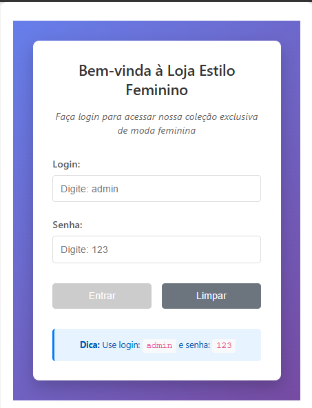
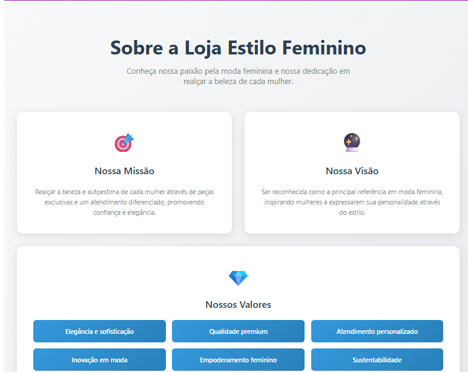
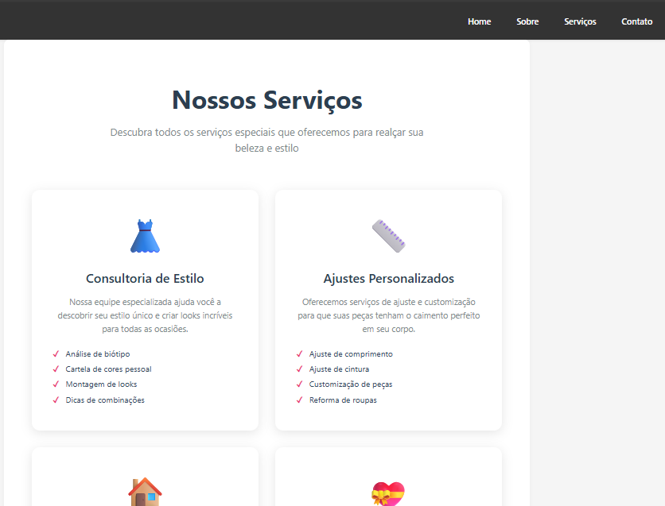
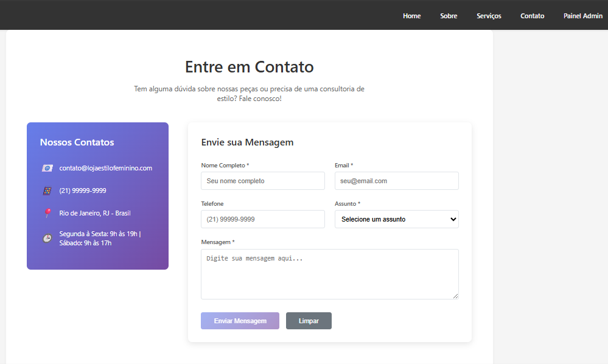

# 🚀 Loja Estilo Feminino - Sistema de E-commerce com Angular

Este projeto é uma aplicação completa de **Angular 19** para uma loja de roupas femininas que implementa um sistema de e-commerce com autenticação, catálogo de produtos e área administrativa. O objetivo é demonstrar conceitos fundamentais do desenvolvimento web moderno usando Angular.

## 🎨 Screenshots das Páginas

### 🔐 Página de Login

*Página inicial com autenticação obrigatória para acesso ao sistema*

### 🏠 Página Home

*Página principal com catálogo de produtos em layout responsivo de 3 colunas*

### ℹ️ Página Sobre

*Página institucional com carrossel automático e informações sobre a loja*

### �️ Página Serviços

*Página com informações sobre os serviços oferecidos pela loja*

### 📞 Página Contato

*Formulário de contato completo com validação e design responsivo*

### 🎛️ Painel de Controle

*Área administrativa restrita com dashboard e estatísticas*

## 📋 Sobre o Projeto

O sistema simula uma **loja de roupas femininas** com:
- **Catálogo de produtos** (vestidos, blusas, saias, jeans, blazers)
- **Sistema de login** com validação de credenciais
- **Área administrativa** (Painel de Controle) protegida por guard
- **Formulário de contato** com validação completa
- **Design responsivo** com layout em 3 colunas
- **Navegação dinâmica** e feedback visual em tempo real

### 🔐 Credenciais de Acesso
- **Usuário:** `admin`
- **Senha:** `admin`

## 🛠️ Tecnologias Utilizadas

- **Angular 19** - Framework principal para construção da SPA
- **TypeScript** - Linguagem para desenvolvimento dos componentes e serviços
- **HTML5 & CSS3** - Estrutura e estilização com design responsivo
- **Angular Router** - Gerenciamento de rotas e navegação
- **Angular Forms** - Formulários reativos com validação
- **RxJS** - Gerenciamento de estado reativo
- **Guards** - Proteção de rotas com controle de acesso
- **Services** - Injeção de dependência e compartilhamento de dados

## 🏗️ Arquitetura do Projeto

```
src/app/
├── header/                 # Componente de navegação principal
├── home/                   # Página inicial com catálogo de produtos
├── pages/
│   ├── sobre/             # Página sobre a loja (com carrossel)
│   ├── servico/           # Página de serviços da loja
│   ├── contato/           # Formulário de contato completo
│   ├── painel-component/  # Formulário de login
│   └── painel-controle/   # Dashboard administrativo (área restrita)
├── service/
│   ├── auth.service.ts    # Serviço de autenticação
│   └── produtos-service.ts # Serviço de produtos de moda
├── guards/
│   └── auth.guard.ts      # Guard de proteção de rotas
└── app.routes.ts          # Configuração das rotas protegidas
```

## ⚡ Funcionalidades Implementadas

### 🔒 Sistema de Autenticação
- Formulário de login com validação
- Persistência de sessão no localStorage
- Logout com limpeza de estado
- Feedback visual para erros e sucessos

### 🛡️ Proteção de Rotas
- Guard `authGuard` protege área restrita
- Redirecionamento automático para login
- Verificação de autenticação em tempo real

### �️ Catálogo de Produtos
- Cards responsivos organizados em 3 colunas
- Produtos de moda feminina (vestidos, blusas, saias, etc.)
- Layout adaptativo para mobile e desktop
- Design moderno com gradientes e hover effects

### 📝 Formulário de Contato
- Validação completa de campos
- Design responsivo e moderno
- Feedback visual para o usuário
- Campos: nome, email, telefone, assunto e mensagem

### 🎨 Design e UX
- Layout responsivo (mobile-first)
- Animações e transições suaves
- Feedback visual consistente
- Gradientes e efeitos modernos
- Footer otimizado e compacto

### 🖼️ Carrossel de Imagens
- Carrossel automático na página Sobre
- Transições suaves entre imagens
- Controle automático com timer
- Design elegante e moderno

## 🚀 Como Executar

### Pré-requisitos
- Node.js (versão 18+)
- Angular CLI

### Instalação e Execução

1. **Clone o repositório:**
```bash
git clone <url-do-repositorio>
cd site
```

2. **Instale as dependências:**
```bash
npm install
```

3. **Execute o servidor de desenvolvimento:**
```bash
ng serve
```

4. **Acesse a aplicação:**
```
http://localhost:4200
```

## 📸 Como Adicionar Screenshots

Para atualizar os screenshots das páginas:

1. **Acesse a aplicação em execução**
2. **Navegue pelas páginas e tire prints**
3. **Salve as imagens na pasta:** `docs/screenshots/`
4. **Nomeie os arquivos como:**
   - `login.png` - Página de login
   - `home.png` - Página inicial
   - `sobre.png` - Página sobre
   - `servicos.png` - Página de serviços
   - `contato.png` - Página de contato
   - `painel-controle.png` - Dashboard administrativo

## 🧭 Como Usar

1. **Navegação Pública:**
   - Faça login primeiro com: `admin` / `admin`
   - Acesse Home, Sobre, Serviços e Contato
   - Visualize o catálogo de roupas femininas

2. **Catálogo de Produtos:**
   - Visualize produtos em layout de 3 colunas
   - Design responsivo para mobile
   - Hover effects nos cards

3. **Formulário de Contato:**
   - Preencha todos os campos obrigatórios
   - Validação em tempo real
   - Feedback visual de erros

4. **Dashboard:**
   - Acesse o Painel de Controle
   - Visualize estatísticas do sistema
   - Faça logout quando necessário

## 🔧 Comandos Úteis

```bash
# Servidor de desenvolvimento
ng serve

# Build para produção
ng build

# Testes unitários
ng test

# Gerar novo componente
ng generate component nome-do-componente

# Gerar novo serviço
ng generate service nome-do-servico
```

## 📚 Conceitos Aplicados

- **Componentes** e comunicação entre componentes
- **Serviços** e injeção de dependência
- **Roteamento** e navegação
- **Guards** e proteção de rotas
- **Formulários reativos** e validação
- **Observables** e programação reativa
- **Pipes** para formatação de dados
- **Lifecycle hooks** do Angular

## 🎯 Objetivos de Aprendizado

Este exercício demonstra:
- Estruturação de projetos Angular para e-commerce
- Implementação de autenticação com guards
- Uso de guards para proteção de rotas
- Criação de interfaces responsivas modernas
- Gerenciamento de estado com serviços
- Formulários com validação completa
- Layout responsivo com CSS Grid
- Boas práticas de desenvolvimento Angular

---

**Desenvolvido com Angular 19** | **Loja Estilo Feminino** | **Julho 2025**
